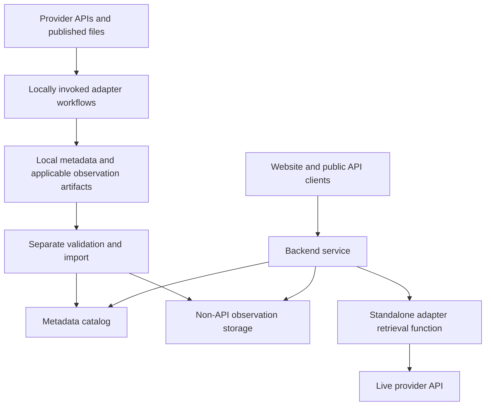

# Architecture

## Status and Scope

**Accepted direction, 2026-09-23.** This document records agreed component responsibilities and data flows. It does not establish which components are implemented. Repository assignments are tracked in [Repository Responsibilities](repositories.md); current integration targets are in [Project Goals](goals.md).

Initial harvesting and refresh run locally through explicit invocation. Hosted harvesting workers and processes are deferred until further notice. The production components below describe the intended service architecture.

Deferring hosted harvest processes does not defer the architectural role of the future live backend; request-time retrieval and scheduled harvesting are separate responsibilities.

## Core Data Boundary

| Source capability | Harvested outputs | Production observation retrieval |
| --- | --- | --- |
| Observations queryable through an API | Dataset metadata | Query the provider live using its adapter's retrieval function. |
| Observations not accessible or queryable through an API | Dataset metadata, processed observations, and file descriptions and tracking information | Query observations imported into NordicIntel storage. |

NordicIntel does not persist API-queryable datasets' observations in production. Replicating those datasets would create substantial storage requirements without serving the intended access model. Production observation storage is reserved for data that cannot be queried through an upstream API.

Apply this distinction per dataset or table, not merely per provider. A provider may offer both queryable API datasets and file-only products. A temporary retrieval failure does not change a dataset's storage category.

## Component Responsibilities

### Adapter Repositories

Use one repository per adapter. Each owns the complete local workflow: source discovery, retrieval, processing, metadata generation, and harvest/refresh execution. Outputs are local files; production writes belong to a separate import workflow.

For API sources, the same repository also owns a standardized, standalone observation retrieval function. Metadata harvesting and retrieval stay together because they share source-specific knowledge and implementation context.

The repository must allow the retrieval function to be installed and imported separately from harvesting functionality. The live backend uses only this retrieval functionality. The packaging mechanism remains to be specified.

### Shared Schemas

Use the [verified schema references](repositories.md#verified-schema-references) for the authoritative definitions and reviewed release status. They describe harvester/scraper/wrapper output, not a runtime package or the public API contract.

The dataset profile is JSON-stat2 metadata-only: `version: "2.0"`, `class: "dataset"`, `value: []`, `label`, ordered dimension `id`, actual category counts in `size`, complete `dimension` metadata, and `extension.nordicintel`. Empty observations do not shrink the dimensions or their sizes. This applies to both API and file-based integrations; processed file observations are a separate artifact.

Emit one complete document per available supported language (`sv` or `en`). `extension.nordicintel` requires `provider_code`, the provider's opaque, case-sensitive `dataset_code`, and `language`. Preserve codes and source text without slugifying identifiers, manufacturing translations, or silently falling back between languages. Root `id` orders dimensions; harvesters do not construct public `dataset_id` values.

Use standard JSON-stat2 fields and defined NordicIntel fields where their meaning fits. Namespace bodies are open objects: `nordicintel` is reserved for shared metadata, while provider and adapter namespaces carry their respective extras. Their open contents do not permit duplicate aliases or bypassing defined constraints. Custom category metadata belongs under `dimension.<id>.extension.<namespace>.categories.<code>`, not `category.extension`.

The optional `extension.nordicintel` fields `source_url`, `doc_url`, `metadata_url`, and `data_url` point outward to provider pages, documentation, metadata, and observations. Supply known retrieval URLs for direct reuse, even when derivable; they do not encode request bodies. Public API links are a separate consumer concern. Standard `href` and `link` cover additional resources, not replacements for those named fields.

### Validation and Import

A separate workflow validates local artifacts and imports metadata into the production catalog and non-API observations into production observation storage. This boundary separates source-specific harvesting from production persistence.

Validate with Draft 2020-12 and format checking enabled. Consumers also enforce the schema guide's semantic invariants: dimension membership and category counts, unique contiguous index positions, valid category and hierarchy references, role assignments, elimination references, namespace ownership, and resource scope/duplication. Schema defaults do not insert values. Upstream CI checks tooling and the generated reference; it does not validate harvested outputs for consumers.

The metadata document shape is defined. Storage technologies, artifact packaging, processed observation and operational tracking formats, and exact import interfaces remain open.

### Production Catalog and Backend

The metadata catalog supports discovery and supplies the source context needed for retrieval. The backend serves the website and public API, routing observation requests either to an upstream API through an adapter function or to stored non-API observations.

The backend supplies an `aiohttp.ClientSession` to API retrieval functions, enabling centralized HTTP behavior and execution control. Functions use the supplied session; session lifecycle belongs to the caller.

The shared retrieval contract must cover dataset identification, observation selection, and normalized results. Exact arguments, result schemas, and error contracts are deferred to a dedicated specification. Normalization preserves source dimensions, units, definitions, and caveats; cross-source harmonization is a separate future concern.

## Data Flows

The live API retrieval path does not write observations into production storage.

## File-Based Sources and Refresh

File integrations produce metadata and queryable observation data. They must also retain file information: source page and download addresses, available web descriptions and comments, last-fetched time, last-checked time, and relevant release or version details where available. Retaining original files locally is optional; retaining their descriptive and tracking information is required and must be carried through the import boundary.

Track changes according to each source's publication behavior. A small annual collection may need only a new-release check. Distinguish checking a source from fetching a file, and document what triggers reprocessing.

Root dataset `updated` means the provider-reported modification date, not a fetch or check timestamp. The current schema does not define shared last-checked/last-fetched fields or a file-tracking record contract. Retain this required operational information without inventing standard fields or overloading existing meanings; its representation remains an import/artifact design decision.

## Open Implementation Decisions

- Separate installation and packaging of retrieval functionality within each adapter repository.
- Exact retrieval signatures, result and error contracts, and local artifact packaging; the dataset metadata document shape is already defined.
- Processed file observations and operational file-tracking records, including their links to metadata.
- Import validation, update semantics, and production storage technologies.

Resolve these in the relevant implementation repositories and link their contracts here. The [Project Overview](project-overview.md) describes the broader product direction and development stages.
